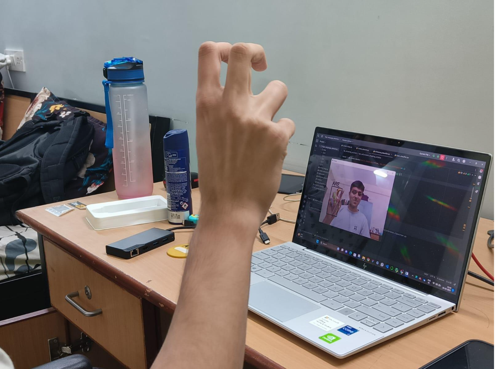

# ✋ Selective Mutism — Hand Gesture ➜ Text

Assistive, real-time **hand-gesture-to-text** system aimed at helping people with **selective mutism** (and anyone who prefers hands over voice) communicate using a webcam. The app detects a single hand, recognizes the sign, and builds words/sentences on screen.



---

## Why this project?

People who can’t speak in certain social situations often rely on gestures or writing. This tool turns **hand signs into text** instantly so conversations can flow in classrooms, workplaces, clinics, or day-to-day life.

---

## What it does

- **Live hand tracking** via webcam  
- **Gesture recognition** with a lightweight ML classifier (Random Forest)  
- Uses **~42 features** from one hand (2D landmark pairs)  
- **Word builder**: append predicted letters/words to an on-screen text area  
- **Low-latency**: runs locally on CPU; no internet required

---

## Tech Stack

- **Python**
- **OpenCV** – camera frames & drawing
- **MediaPipe** (or similar) – hand landmarks
- **scikit-learn** – Random Forest classifier
- **NumPy / Pandas** – feature processing

> Model idea: extract 21 landmark points → normalize → build a 42-feature vector (x,y) → predict letter/word.

---

## Getting Started

### 1) Clone
```bash
git clone https://github.com/Ridit07/Selective-Mutism-Hand-Gesture-To-Text.git
cd Selective-Mutism-Hand-Gesture-To-Text
```

### 2) Install deps
```bash
# create & activate a venv (recommended)
python -m venv .venv
# Windows
.venv\Scripts\activate
# macOS/Linux
source .venv/bin/activate

pip install -r requirements.txt

```

#If you don’t have a requirements.txt, install the essentials:

```bash
pip install opencv-python mediapipe scikit-learn numpy pandas
```

### 3) Run
```bash
python app.py
```

---

## ▶️ Usage

1. **Allow webcam access** when prompted.  
2. **Hold your hand inside the guide box** and show a supported sign.  
3. Watch predictions appear in real time.  
4. Press **Space** or **Enter** (or click the on-screen button) to add the prediction to the text area.  

> 💡 If your entry file is named differently, run it accordingly:  
> ```bash
> python main.py
> ```

---

## ⚙️ How It Works

1. **Capture** – Read webcam frames using OpenCV.  
2. **Landmarks** – Detect a single hand and extract **21 keypoints**.  
3. **Features** – Normalize coordinates (scale/translate) into a **42-dimensional vector**.  
4. **Predict** – Random Forest classifier maps features to a letter/word.  
5. **Compose** – Append results into an editable text area for live communication.

---

## 🏋️‍♂️ Train Your Own Model (Optional)

1. **Record landmark samples** for each class (A–Z / words).  
2. **Build a CSV** of features and labels.  
3. Train with:

```python
from sklearn.ensemble import RandomForestClassifier

clf = RandomForestClassifier(n_estimators=300, max_depth=None, random_state=42)
clf.fit(X_train, y_train)

# Save model
import joblib
joblib.dump(clf, "models/rf_gesture.pkl")
```

4. Replace the file models/rf_gesture.pkl in the app.

